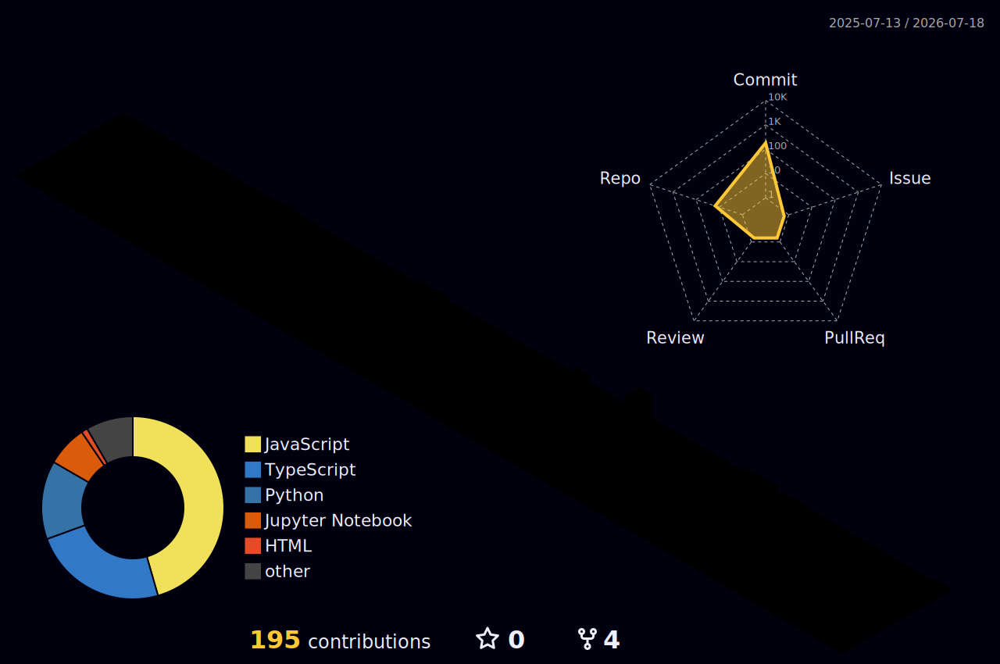

 

 

## 🛠️ Stack

  

 

## 🚀 Featured Projects

<table>
<tr>
<td>

</td>
<td>

</td>
</tr>
<tr>
<td>

</td>
<td>

</td>
</tr>
<tr>
<td colspan="2" align="center">

</td>
</tr>
</table>

 

## 📊 Stats

 

 

## 🐍 Contribution Snake

<picture>
  <source media="(prefers-color-scheme: dark)" srcset="https://raw.githubusercontent.com/ubhranipreetish/ubhranipreetish/output/github-snake-cyan.svg" />
  <source media="(prefers-color-scheme: light)" srcset="https://raw.githubusercontent.com/ubhranipreetish/ubhranipreetish/output/github-snake.svg" />
  
</picture>

 

## 🏙️ 3D Activity

 

## 🏆 Trophies

 

## ⚔️ Competitive Programming

 

 

